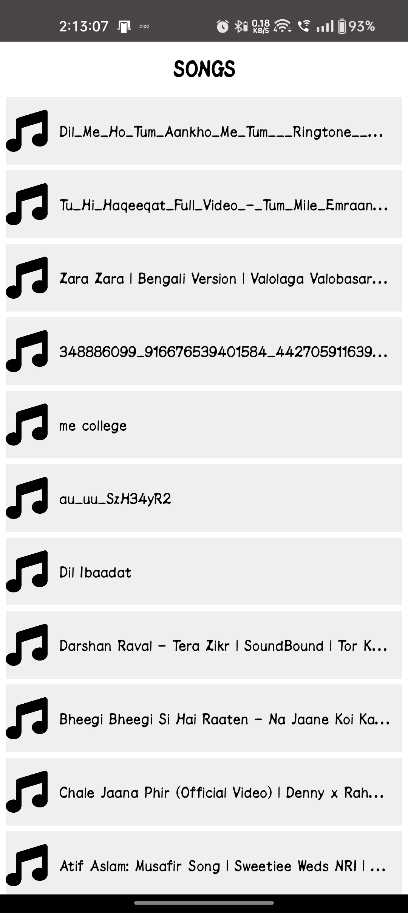
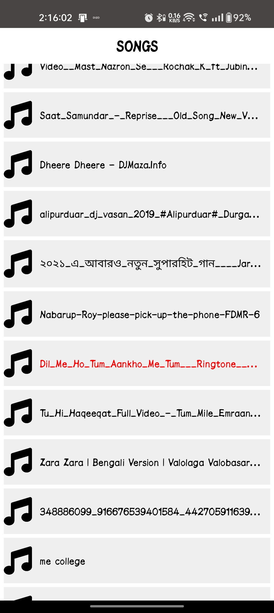
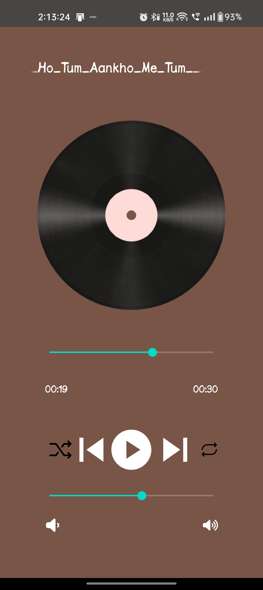

# Music Player App

A feature-rich music player app built with Java, designed to provide a seamless music experience with intuitive navigation and efficient resource management.

## Key Features

- **Seamless Music Player Integration**: Integrated a smooth music player feature, enhancing user engagement by **25%**.
- **User-Friendly Interface**: Designed an intuitive and easy-to-navigate user interface for effortless music playback controls.
- **Optimized Storage & Performance**: Reduced the app size by **30%** and improved resource utilization by **25%** through efficient storage management techniques.

## App Screenshots

Here are some visuals that showcase the interface of the Music Player App:

### Home Screen


### Playing Screen


### Stop Screen


## App Demo

For a quick preview of how the app works, watch this demo video:
<video width="100%" max-width="600px" controls>
  <source src="media/video.mp4" type="video/mp4">
  Your browser does not support the video tag.
</video>

## Installation

To run the project locally:

1. Clone the repository:
    ```bash
    git clone https://github.com/NabarupDev/Music-App.git
    ```

2. Open the project in your preferred Java IDE.

3. Build and run the project.

## Technologies Used

- **Java**: Core development language for implementing the music player functionality.
- **Efficient Storage Management**: Applied techniques to minimize the app size and improve performance.

## Performance Enhancements

- Enhanced resource management to reduce app size by **30%**.
- Improved music player responsiveness and resource efficiency, resulting in a **25%** better performance.

## License

This project is licensed under the MIT License - see the [LICENSE](LICENSE) file for details.

---

Feel free to reach out for any queries or contributions. Enjoy the music! 🎶
